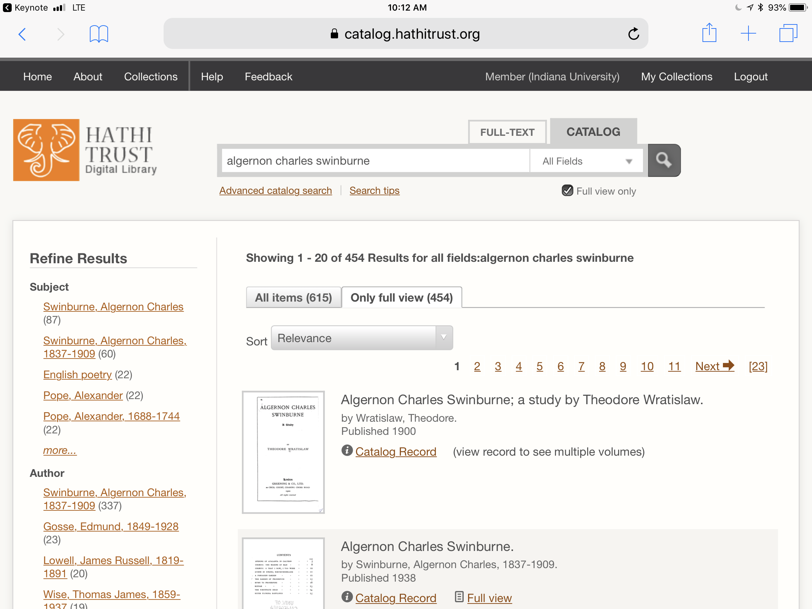
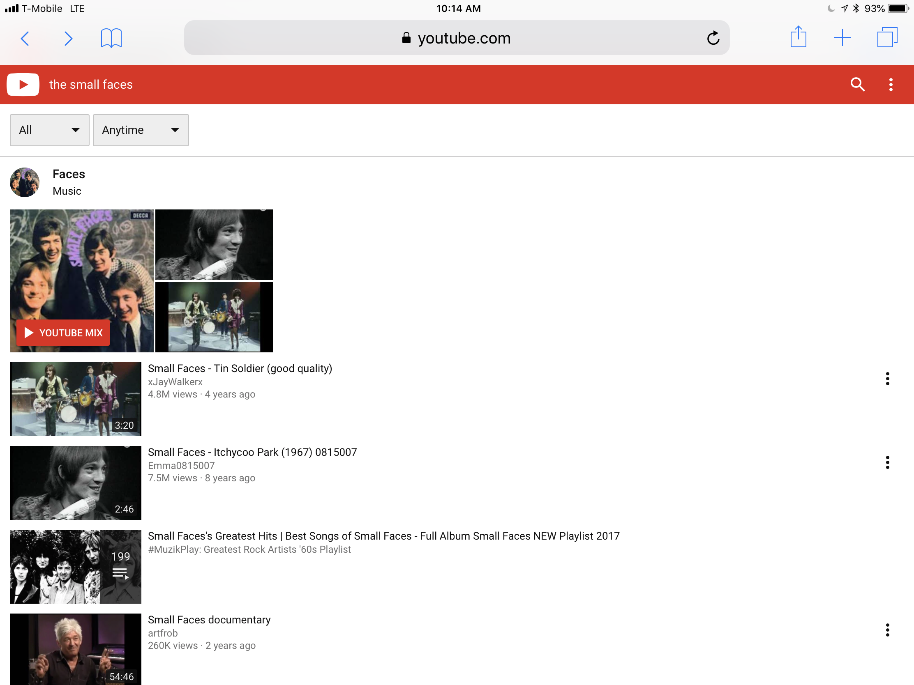
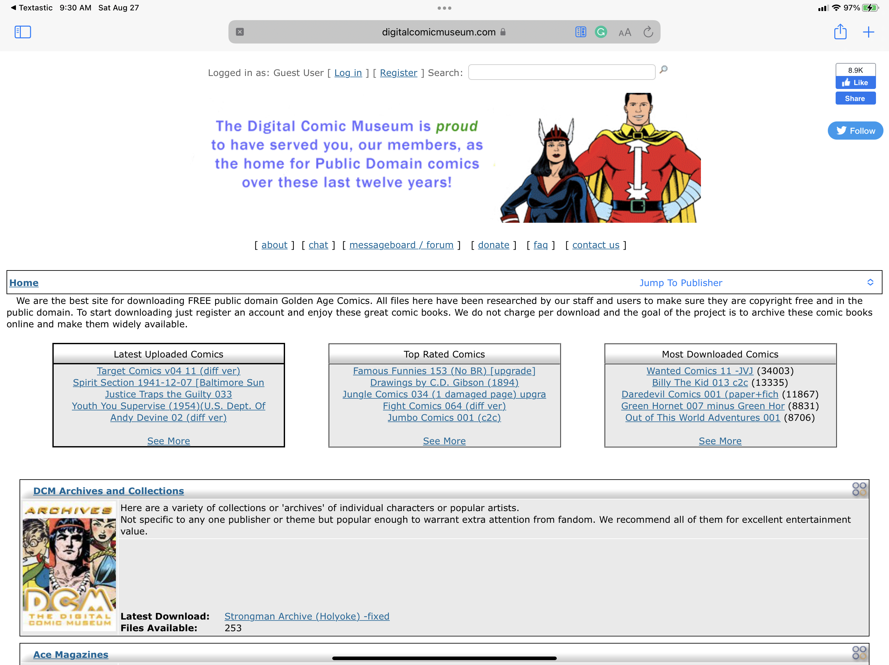
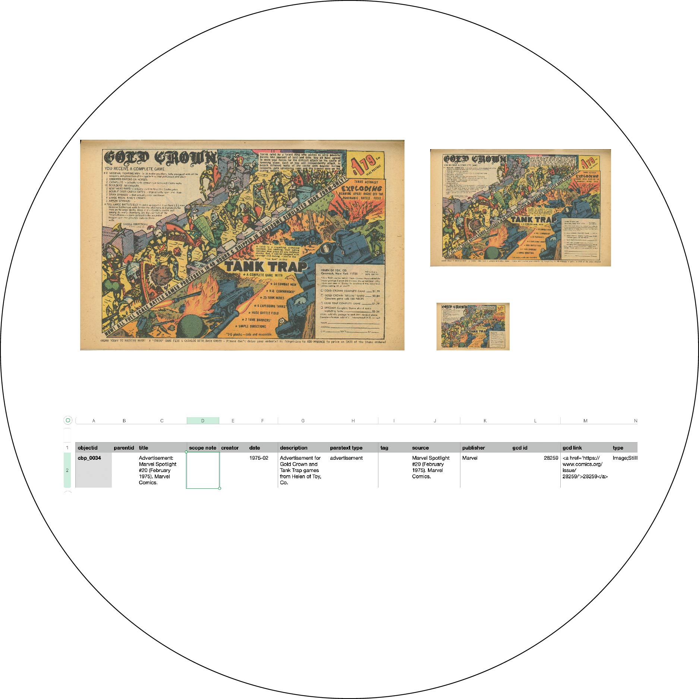
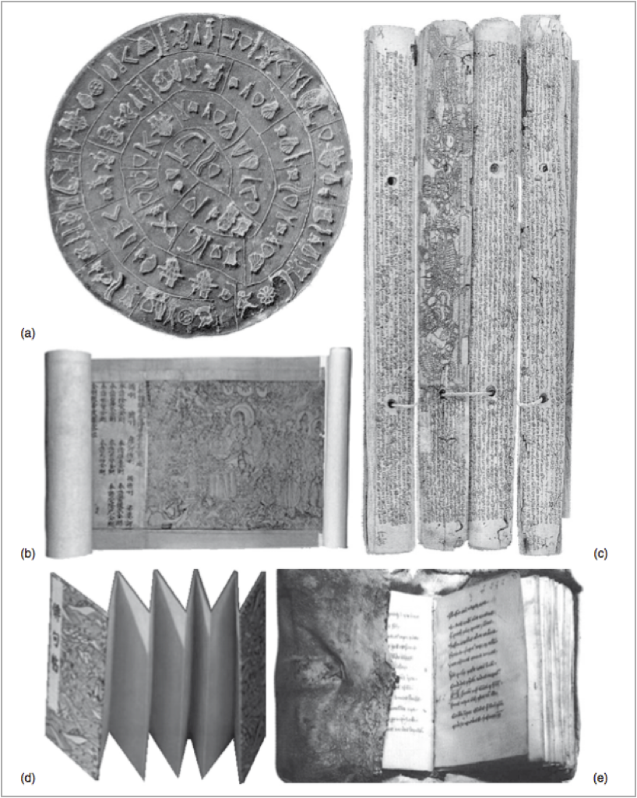

## Example final projects
### Omeka
- Lara Bell. [Into the Archives](https://lebell.omeka.net).
- Mikala Narlock. [Richard E. Norman and Filmmaking](https://richardenorman.omeka.net).
- Hannah Ensign-George. [Paving the Way](https://pavingtheway.omeka.net).

### Collection Builder
- Hanna Bencheck. [Butterflies in Rare Books From the Lilly Library at Indiana University Bloomington](https://hbenchik.github.io/Collection-Builder/)
- Alex Caba. [A Requiem on Stone and Board: A Digital Collection of Kentucky Vernacular Architecture](https://nacaba17.github.io/StoneAndBoard/)
- Erin Walden. [Bookmarked](https://erinwalden.github.io/bookmarked/)
- Akanksha. [HCI/depot](https://hcidcapstone.luddy.indiana.edu) (requires IU vpn connection)
- Kathryn Bullock. [RFK’s Indiana Campaign](https://katebull.github.io/rfkindianacamp/about.html)
- Sarah Carter. [Music Librarianship at IU](https://supertonic2.github.io/muslib/)

---
## What is a digital library?
> a focused collection of digital objects, including text, video, and audio, along with methods for access and retrieval, and for selection, organization, and maintenance of the collection. (Witten, et al., p. 7)
---

---

---

---

---
## Digital object

---

## Digital object

---
## Types of digital objects
- text (books, manuscripts, pamphlets, etc.)
- images (photographs, paintings, etc.)
- audio (interviews, speeches, music, etc.)
- video (film, video)
- 3D objects
- simulations
- visualizations
- virtual reality
- games
---
## Metadata
- the cataloging for digital libraries and digital content.
- Metadata/cataloging is often the most important and time-consuming task for any library, digital or traditional.
- Building the catalog for Trinity College Dublin took thirty-six years (1851-1887).
---
#### Metadata as a conceptual model
A library catalog is a complete model that represents, in a predictable manner, the universe of books in the library. Catalogs provide a summary of library contents. Today we call this metadata. And it is highly valuable in its own right. 
- catalogs
- bibliographies
- indexes
---
#### Metadata as a conceptual model
As a late 19th-century librarian wrote, 

> Librarians classify and catalog the records of ascertained knowledge, the literature of the whole past. In this busy generation, the librarian makes time for his fellow mortals by saving it. And this function of organizing, of indexing, of time-saving and thought-saving, is associated peculiarly with the librarian of the 19th century.

(Witten, et al., p. 17)
- catalogs
- bibliographies
- indexes
---
#### Book technology

---
## Copyright
- [Cornell University Copyright Information Center](https://copyright.cornell.edu)
	- [Copyright Term and the Public Domain in the U.S.](https://copyright.cornell.edu/publicdomain)
- [Stanford University Copyright Renewals Database](https://library.stanford.edu/collections/copyright-renewal-database)
- [creative commons license](http://creativecommons.org/)